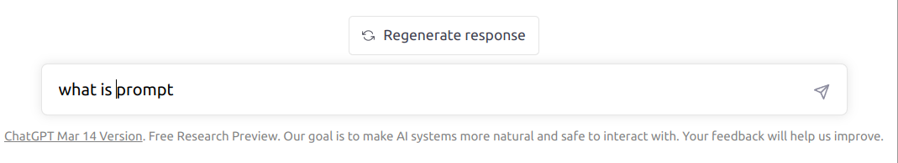
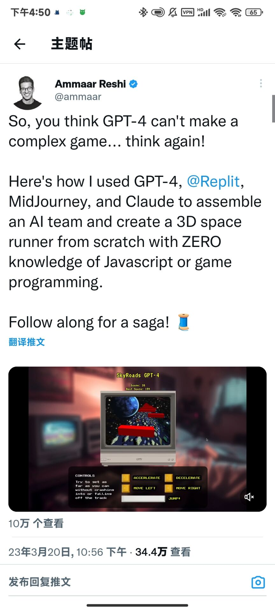

---
title:
    拥抱chatGPT
data: 2023-3-21
---
# 对于如何应用chatGPT等自然语言模型的思考 :running:

## 何为chatGPT
ChatGPT是一种大型语言模型，可以进行类似人类交流的自然语言处理任务。
## chatGPT可以干什么
ChatGPT可以进行类似人类交流的自然语言处理任务，包括但不限于:

1. 对话：ChatGPT可以模拟人类对话，回答用户的问题，进行日常的闲谈交流。

2. 问答：ChatGPT可以回答用户的问题，查询相关信息，提供帮助和指导。

3. 文本生成：ChatGPT可以根据给定的文本或语境，生成与之相关的文章、段落或句子，例如自动写作、机器翻译等。

4. 文本分类：ChatGPT可以根据文本的内容和语义，将其分类到不同的类别，例如情感分析、新闻分类、垃圾邮件过滤等。

5. 智能推荐：ChatGPT可以根据用户的历史数据和行为，为其推荐相关的商品、服务、内容等。

总之，ChatGPT在人工智能领域有着广泛的应用，可用于自然语言交互、语音识别、图像识别等多个领域。

## 要怕chatGPT嘛
自从去年（2022年）chatGPT“火”了以后，我经常能看到两种对于chatGPT截然不同的观点。
> 1. chatGPT将要取代程序员(由于笔者身为程序员，所以由于自己的局限，听到的都是和我相关的消息)
> 2. 疯狂抓紧时间利用chatGPT进行创造。造出了一系列chatGPT应用
### 而我自己对于chatGPT的观点，也有一个转变的过程：
* 我刚刚得知，有这么厉害的ai的时候，我的态度是拒绝接受，因为太火了，到处都有chatGPT的消息。我拒绝听一些这样的消息，并且真的非常害怕它会取代我将来的工作。
* 后来我开始逐渐使用chatGPT，newBeing，或者一些AI的应用，我发现我已经离不开它了。因为它真的很好用。但是，这个阶段，我还是把chatGPT当做Google在用。并且我也尝试“跟风”，去创造自己我的chatGPT应用。
* 第三个阶段，也就是现在，偶然看到一些视频，给了我新的启发。下面详细的说。

## 人人都是创造者 - 如何拥抱未来
### 首先，我们要明白编程语言发展的历史。
>编程语言的发展可以分为以下几个阶段(由chatGPT生成)：
>
>1. 机器语言阶段（1940s-1950s）：最初的计算机程序是直接用二进制代码表示，这种编写程序的方式称为机器语言。由于人类难以理解和编写，这种编程方式极为繁琐，因此很快开发出了汇编语言。
>
>2. 汇编语言阶段（1950s-1960s）： 汇编语言用符号代替机器语言的二进制码，提升了代码的可读性，但依然需要直接操作硬件。 Fortran，Lisp和COBOL是这个时期的例子。
>
>3. 高级语言阶段（1960s-1980s）：高级语言的发明和广泛应用推动了计算机领域的迅猛发展。高级语言通过抽象机器细节，使程序员可以快速开发复杂应用。 ALGOL，BASIC，C，C++，Java和Python等都是这个时期的例子。
>
>4. 面向对象阶段（1980s-2000s）：面向对象编程（OOP）旋风席卷全球，OOP语言提供了另一种较为高层次的编程抽象。这个时期的代表编程语言包括Smalltalk，C++，Java，Ruby等。
>
>5. 解释型和动态语言阶段（2000s-至今）：动态编程语言在这个时期开始变得流行，包括Python，Ruby和JavaScript。这类语言使得代码的开发速度更快，易于学习和使用，并且可以快速迭代和部署。同时，多核心和云计算的发展也推动了并行和后端开发语言的发展，比如Go，Rust和Scala等。
>
>总之，编程语言的发展是伴随着计算机技术的演变而逐渐成形的，每一代编程语言都在缩小人类和计算机之间的间隔，提升了代码开发的效率和程序的可读性。

可以看到，编程语言的发展，其实是越来越拉进人与计算机之间的距离，我们的目始终是利用编程去有效率的解决问题。现在的chatGPT，其实是给人类了一种用自然语言利用计算机解决问题的能力。这让每个个体都能够拓展自己的边界。去做之前可能做不到的事情。对每个个体来说，其实是一种福祉。

### 自然语言编程

很多chatGPT相关文章或者视频中，经常出现prompt这个东西，那它到底是什么呢？
> prompt是指在计算机或网络应用中，通常用于提示用户输入信息的对话框或文本输入框。当应用程序需要用户输入数据或进行选择时，它们通常会使用prompt对话框，以便提示用户输入信息，例如在浏览器前端输入文本，或在控制台中读取用户输入的文本等。它可以接受用户输入，处理数据并根据数据做出相应的响应或操作，是交互式计算机程序的重要组成部分。
>
我理解中，prompt在很多语境中就是你给AI的指令。

通俗来说，这就是prompt

随着ai的发展，出现了`Prompt engineering`这种东西。`Prompt engineering`就是从事自然语言生成的岗位，目的在于通过文本提示，让语言模型输出自己想要的结果。

对于个体来说，就是可以在不会编程的情况下，生成自己的程序。每个人自己就是`Prompt engineering`
> 比如，可以从0开始利用chatGPT写一个游戏
> 

总而言之，chatGPT实际上是一种工具。
* 学习某样东西的成本变得很低。
* 可以提高工作效率，代替某些繁复的工作。
* 提供是一种低门槛的手段，使人们可以轻松地启动并与计算机交互，以解决自己的问题。
  
### 真的有那么好嘛？
其实编程并不是如何和机器沟通这么简单。掌握一门编程语言并不意味着学会了编程。我觉得编程的重点在于逻辑，就像和某个外国人沟通，只要让他理解，肢体语言都可以达到这个目的。怎么利用好这个工具，其实很大程度取决与用这个工具的人。
* 创造力
* 清晰的思考和沟通
* 整合资源的能力

AI的边界其实是人的边界
## 启示
* 用chatGPT提升效率
* 以后可以再“大胆”一些，利用AI实现自己的想法。
* 拓展自己的边界，多尝试感兴趣的领域，多思考
* 转变身份，从螺丝钉转换为一个“创造者”

## 后记
* 也许我之前觉得，我生在一个不好的时代，互联网寒冬、疫情、战争等等不好的事情，都发生在我的大学时期。但是我无比庆幸学了这个专业，它带给我很多思考，给我接触新事物的机会。
* 拥有成长的思维，是我一生要追求的事。
* 写一个文章，把自己的所思所想表达清楚，对我来说其实不是这么简单的事情。现在的想法肯定也有很多不成熟的地方。我以后还会持续关注。希望有更多的思考。

## 参考
1. [ChatGPT给的机会, 你能抓住吗? (自然语言编程)](https://www.youtube.com/watch?v=KoT08Kno10A&t=596s)
2. [GPT 4来了，多模态，新模型会给ChatGPT以及应用带来什么，会怎么改变我们的世界](https://www.youtube.com/watch?v=b3pQ8KIN-Wc&t=910s)
